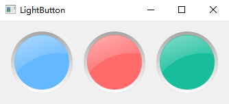

### LightButton

`LightButton`是通过继承`Qwidget`通过重写`paintEvent`方法来自定义一个类似于警告灯的效果




### 简单使用
```python
from PyQt5.QtGui import QColor

from light_button import LightButton
from PyQt5.QtWidgets import QApplication, QWidget
from PyQt5.Qt import QHBoxLayout
import sys


class LightButtonWin(QWidget):
    def __init__(self):
        super(LightButtonWin, self).__init__()
        self.ltbn1 = LightButton()
        self.ltbn2 = LightButton()
        self.ltbn3 = LightButton()
        self.layout = QHBoxLayout()
        self.ltbn2.set_bg_color(QColor(255, 107, 107))
        self.ltbn3.set_bg_color(QColor(24, 189, 155))
        self.layout.addWidget(self.ltbn1)
        self.layout.addWidget(self.ltbn2)
        self.layout.addWidget(self.ltbn3)
        self.setLayout(self.layout)


if __name__ == '__main__':
    app = QApplication(sys.argv)
    win = LightButtonWin()
    win.setWindowTitle('LightButton')
    win.show()
    sys.exit(app.exec_())
```
运行上的代码即可看到效果，或者直接运行`run.py`文件

